# **毕业要求**

## **1.成果要求**

**未达到学制年限申请学术学位博士学术成果要求如下：在博士论文中期评估为优秀的基础上，博士研究生在船舶学院修订的B类及以上期刊上（学院期刊分类详见附件1）至少发表1篇论文的基础上，含该论文在内的全部研究成果满足以下条件之一可以申请博士学位：**

*   [ ] 1\.  A类创新性成果1项，B类创新性成果1项（A类和B类成果可以为同一类别）
*   [ ] 2\.  B类创新性成果3项（同一类别成果可累计）

**达到学制年限申请学术学位博士学术成果要求如下：在博士论文中期评估为良好以上的基础上，博士研究生在船舶学院修订的B类及以上期刊上至少发表1篇论文的基础上，含该论文在内的全部研究成果满足以下条件之一可以申请博士学位：**

*   [ ] 1\.  A类创新性成果1项
*   [ ] 2\.  B类创新性成果2项（可以是同一类别的2个成果）
*   [ ] 3\.  B类创新性成果1项和C类创新性成果2项。（同一类别C类创新成果可累计）

## **2.成果分类**

### **A、B、C类成果共计183项**

**A类创新性成果主要包括：**

1.  论文：船舶学院修订的A类期刊上发表的论文；
2.  科技奖：国家级三大奖（有证书）；省部级科学技术三大奖一等奖（有证书）；
3.  专利：中国专利金奖/银奖（学生前二）；
4.  专著：撰写并出版专著（学生第一或导师第一学生第二，要求获省部级以上出版类项目资助）。

**B类创新性成果主要包括：**

1.  论文：船舶学院修订的B类期刊上发表的论文；船舶学院修订的核心类会议优秀论文；
2.  科技奖：省部级科学技术三大奖二等奖（有证书，同一奖项仅限1人使用）；
3.  专利：获得授权并转化（专利转让或J口正师级以上单位授权使用）的中国发明专利或PCT授权的国际发明专利；
4.  专著：参与撰写专著至少一章（在国家一级出版社正式出版并有学生署名，且在前言中明确该生完成的章节，字数10万字及以上）；
5.  科创奖：中国研究生创新实践系列大赛国赛一等奖负责人或“互联网+”大学生创新创业大赛国赛金奖负责人。

**C类创新性成果主要包括：**

1.  论文：船舶学院修订的C类期刊上发表的论文；
2.  科技奖：省部级科学技术三大奖三等奖（有证书，同一奖项仅限1人使用）；
3.  专利：获得授权并转化（授权使用）的中国发明专利；
4.  专著：参与撰写专著至少一章（出版社正式出版并有学生署名，且在前言中明确该生完成的章节，字数10万字及以上）；
5.  科创奖：作为团队负责人获得中国学位与研究生教育发展中心组织的“中国研究生创新实践系列大赛”国赛二等奖负责人或教育部组织的“互联网+”大学生创新创业大赛国赛银奖负责人。

## 3.期刊分类

**船舶工程学院认定的高水平学术论文期刊分为四类，分别为A、B、C类期刊和核心国际学术会议大会优秀论文，其中1篇核心国际学术会议大会优秀论文等同于1篇B类期刊论文，制定原则如下：**

1.  A类期刊为中科院一区、二区或TOP期刊内与本领域相关的顶级核心期刊，且学院年发表数量少于5篇
2.  B类期刊为中科院二区及以上与本领域相关的核心期刊
3.  C类期刊包括本领域中文和英文核心期刊，其中中文为EI检索，英文为中科院4区及以上期刊
4.  核心类会议大会优秀论文为国内外本领域核心会议推荐的大会优秀论文
5.  该期刊目录每2年根据情况由学术委员会进行调整，且A类期刊的数量严格控制在12本以内
6.  如研究生发表了一篇达到ABC类学术水平的论文，但所属期刊不在该期刊目录内，可由研究生提出申请，经学院学术委员会评议认定

### 3.1 A类期刊

1.  Nature 自然 /Science 科学 / Science Advances 科学进步 / Nature Communication 自然通讯 / PNAS 美国科学院院报 / PRL 物理评论快报

> 综合

2.  Annual Review Of Fluid Mechanics 流体力学年度回顾

> 船舶与海洋工程力学

3.  Engineering Applications Of Computational Fluid Mechanics 计算流体力学的工程应用

> 船舶与海洋工程力学

4. International Journal of Impact Engineering 国际冲击工程学杂志

> 船舶与海洋工程力学

5.  International Journal Of Solids And Structures 国际固体与结构杂志

> 船舶与海洋工程力学

6.  Journal Of Fluid Mechanics 流体力学杂志

> 船舶与海洋工程力学

7.  Journal Of The Mechanics And Physics Of Solids 固体力学与物理学杂志

> 船舶与海洋工程力学

8.  Journal Of Sound And Vibration 声音与振动杂志

> 振动与噪声控制

9.  Applied Energy 应用能源

> 深海工程

10.  Renewable And Sustainable Energy Reviews 可再生能源和可持续能源审查

> 深海工程

11.  International Journal Of Robotics Research 国际机器人研究杂志

> 海洋机器人技术

12.  Journal Of Field Robotics 野外机器人杂志

> 海洋机器人技术

### 3.2 B类期刊

1.  中国科学

> 综合

2.  力学学报（中英文）

> 船舶与海洋工程力学

3.  物理学报

> 船舶与海洋工程力学

4.  Applied Mathematical Modelling 应用数学建模

> 船舶与海洋工程力学

5.  Applied Mathematics And Computation 应用数学和计算

> 船舶与海洋工程力学

6.  Applied Ocean Research 应用海洋研究

> 船舶与海洋工程力学

7.  **Applied Soft Computing 应用软计算**

> 船舶与海洋工程力学 **工程技术-计算机：跨学科应用**

[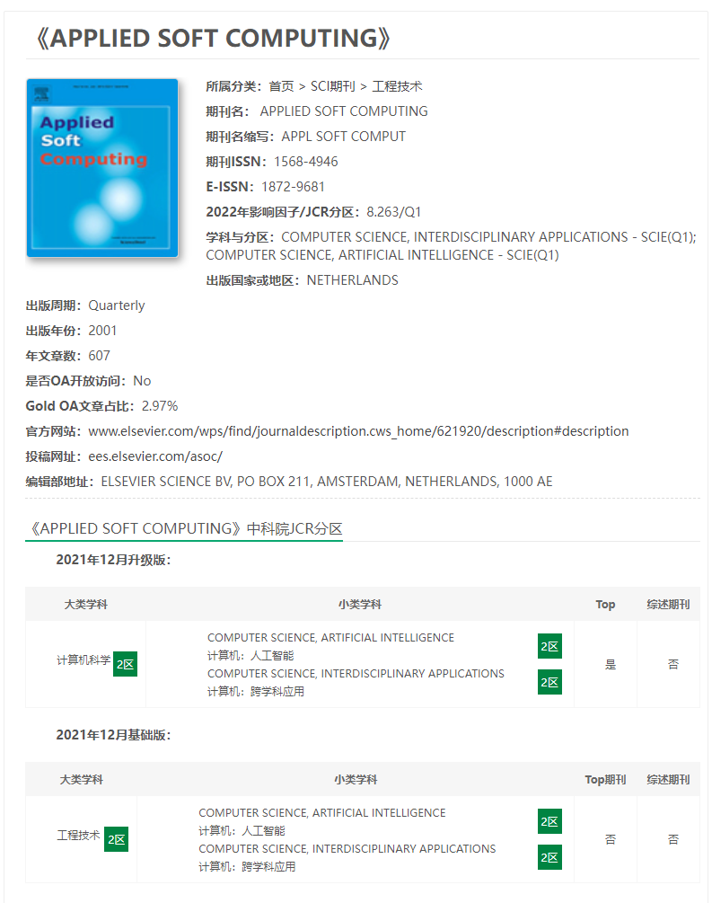](https://www.iikx.com/sci/technology/10418.html)

8.  Archive Of Applied Mechanics 应用力学档案馆

> 船舶与海洋工程力学

9.  Composite Structures 组合结构

> 船舶与海洋工程力学

10.  Computer Methods In Applied Mechanics And Engineering 应用力学与工程中的计算机方法

> 船舶与海洋工程力学

11.  Computer Physics Communications 计算机物理通信

> 船舶与海洋工程力学

12.  Computers & Mathematics With Applications 计算机与数学及其应用

> 船舶与海洋工程力学

13.  Engineering Analysis With Boundary Elements 带边界元的工程分析

> 船舶与海洋工程力学

14.  Experiments In Fluids 流体中的实验

> 船舶与海洋工程力学

15.  International Journal Of Heat And Mass Transfer 国际传热与传质杂志

> 船舶与海洋工程力学

16.  International Journal Of Mechanical Sciences 国际机械科学杂志

> 船舶与海洋工程力学

17.  International Journal Of Multiphase Flow 国际多相流杂志

> 船舶与海洋工程力学

18.  International Journal For Numerical Methods In Engineering 国际工程数值方法杂志

> 船舶与海洋工程力学

19.  International Journal Of Heat And Mass Transfer 国际传热与传质杂志

> 船舶与海洋工程力学

20.  Journal Of Computational Physics 计算物理学杂志

> 船舶与海洋工程力学

21.  Journal Of Fluids And Structures 流体与结构杂志

> 船舶与海洋工程力学

22.  Physica A-Statistical Mechanics And Its Applications 实际的A -统计力学及其应用

> 船舶与海洋工程力学

23.  Physical Review E 物理评述E

> 船舶与海洋工程力学

24.  Physical Review Fluids 物理审查液体

> 船舶与海洋工程力学

25.  Physics Of Fluids 流体物理学

> 船舶与海洋工程力学

26.  Remote Sensing 遥感

> 船舶与海洋工程力学

27.  Thin-Walled Structures 薄壁结构

> 船舶与海洋工程力学

28.  Applied Acoustics 应用声学

> 振动与噪声控制

29.  Composite Part B：Engineering 复合部分B：工程

> 振动与噪声控制

30.  Defence Technology 防御技术

> 振动与噪声控制

31.  Engineering Failure Analysis 工程失效分析

> 振动与噪声控制

32.  Journal Of The Acoustical Society Of America 美国声学学会杂志

> 振动与噪声控制

33.  Journal Of Vibration And Control 振动与控制杂志

> 振动与噪声控制

34.  Coastal Engineering 海岸工程

> 深海工程

35.  Ocean Modelling 海洋模式

> 深海工程
 
36.  Energy 能源

> 深海工程

37.  Energy Conversion And Management 能源转换与管理

> 深海工程

38.  Engineering 工程学

> 深海工程

39.  Iet Renewable Power Generation 使用可再生能源发电

> 深海工程

40.  International Journal Of Energy Research 国际能源研究杂志

> 深海工程

41.  Journal Of Wind Engineering And Industral Aerodynamics 风工程与工业空气动力学杂志

> 深海工程

42.  Marine Structures 海洋结构物

> 深海工程

43.  Ocean Engineering 海洋工程

> 深海工程

44.  Renewable Energy 可再生能源

> 深海工程

45.  **Advances In Engineering Software 工程软件方面的进展**

> 海洋机器人技术 **工程技术-计算机：跨学科应用**

[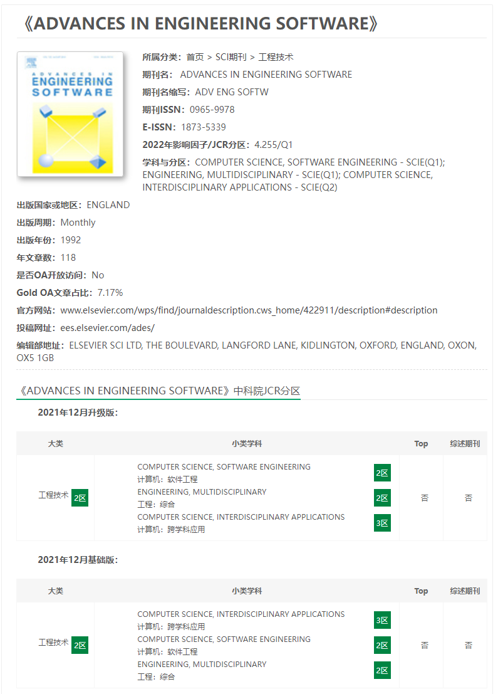](https://www.iikx.com/sci/technology/9913.html)

46.  **Artificial Intelligence 人工智能**

> 海洋机器人技术 **计算机：人工智能**

[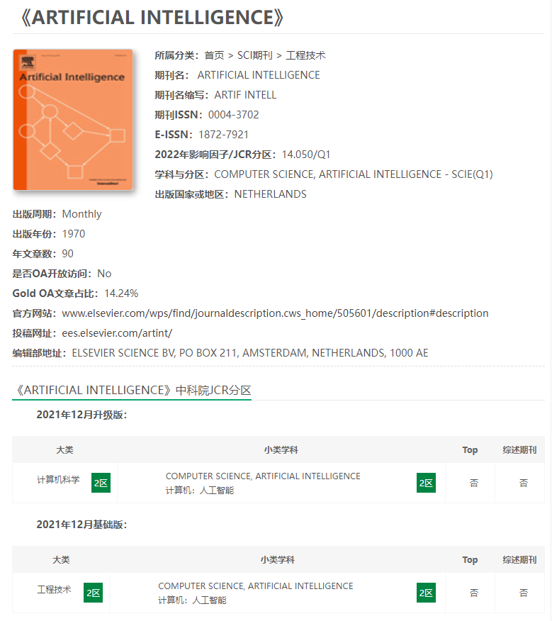](https://www.iikx.com/sci/technology/10550.html)

47.  **Artificial Intelligence Review 人工智能评述**

> 海洋机器人技术 **计算机：人工智能**

[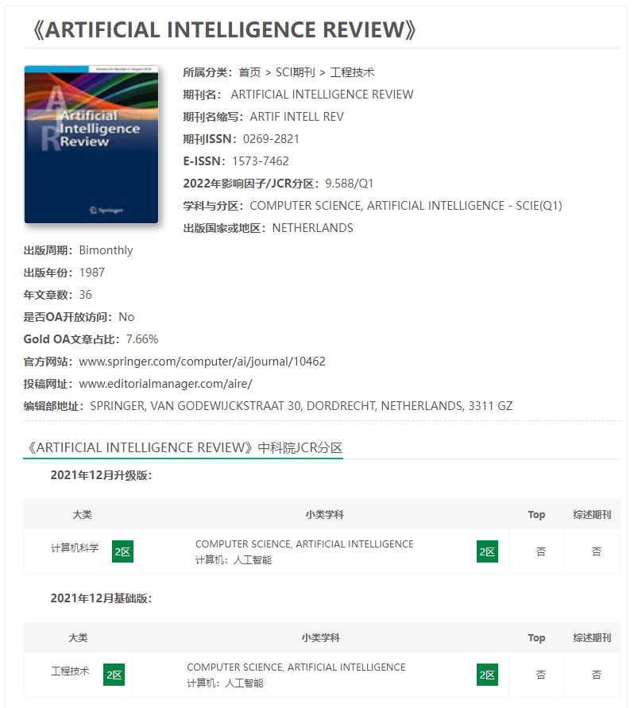](https://www.iikx.com/sci/technology/10552.html)

48.  Control Engineering Practice 控制工程实践

> 海洋机器人技术

[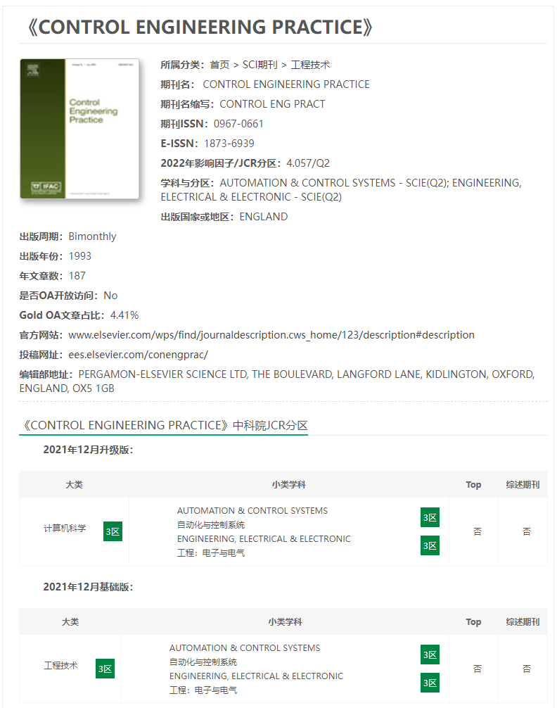](https://www.iikx.com/sci/technology/11699.html)

49.  **Decision Support Systems 决策支持系统**

> 海洋机器人技术 **计算机：人工智能 计算机：信息系统** 运筹学与管理科学

[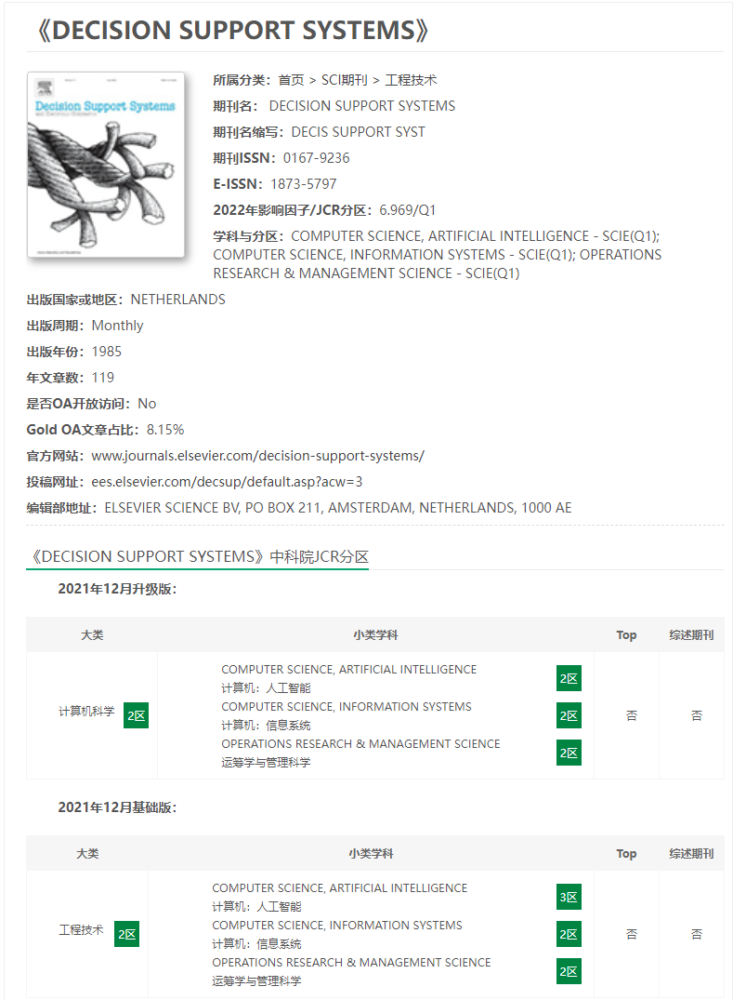](https://www.iikx.com/sci/technology/11874.html)

50.  IEEE Journal Of Oceanic Engineering IEEE海洋工程学报

> 海洋机器人技术

51.  IEEE Robotics And Automation Letters IEEE机器人与自动化快报

> 海洋机器人技术

52.  IEEE Transactions On Geoscience And Remote Sensing IEEE在地球科学和遥感方面的事务

> 海洋机器人技术

53.  **IEEE Transactions On Image Processing IEEE图像处理上的事务**

> 海洋机器人技术 **计算机：人工智能** 工程：电子与电气

[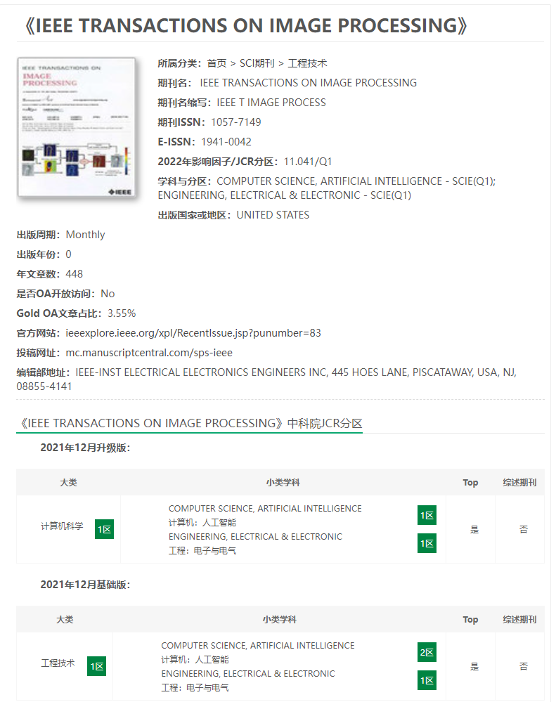](https://www.iikx.com/sci/technology/13024.html)

54.  IEEE Transactions On Industrial Electronics 工业电子事务

> 海洋机器人技术

55.  **IEEE Transactions On Knowledge And Data Engineering 知识与数据工程事务**

> 海洋机器人技术 **计算机：人工智能 计算机：信息系统** 工程：电子与电气

[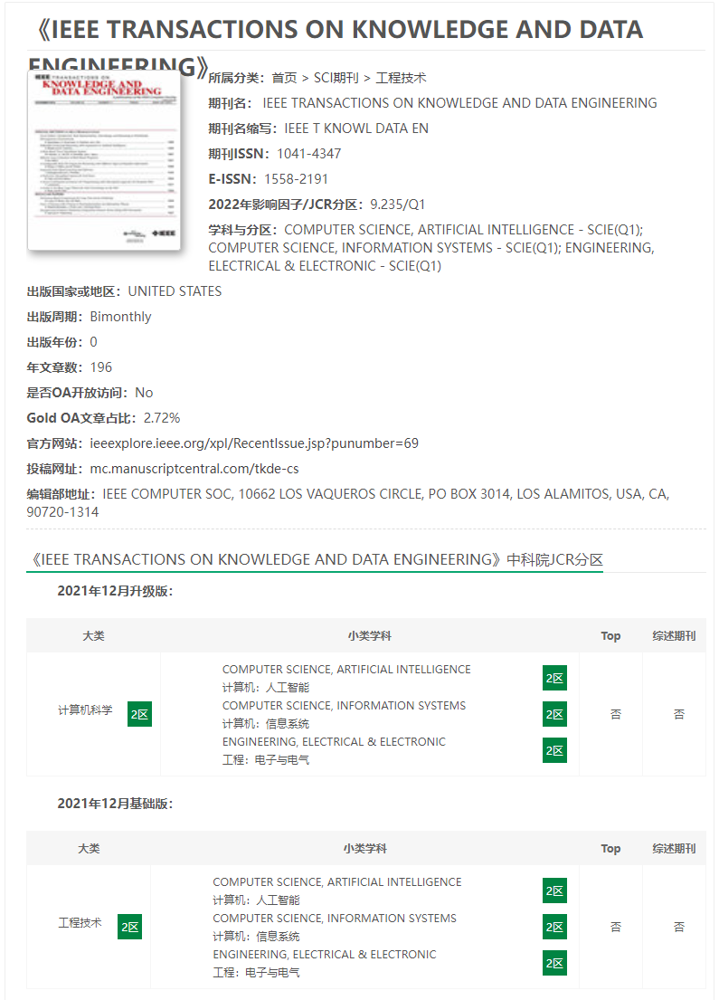](https://www.iikx.com/sci/technology/13033.html)

56.  IEEE-Asme Transactions On Mechatronics IEEE-ASME有关机电一体化的事务

> 海洋机器人技术

57.  International Journal Of Robust And Nonlinear Control 国际鲁棒和非线性控制杂志

> 海洋机器人技术

58.  ISA Transactions ISA事务

> 海洋机器人技术

59.  Journal Of The Franklin Institute 富兰克林研究所杂志

> 海洋机器人技术

60.  **Robotics And Computer-Integrated Manufacturing 机器人和计算机集成制造**

> 海洋机器人技术 **计算机：跨学科应用** 工程：制造 机器人学

[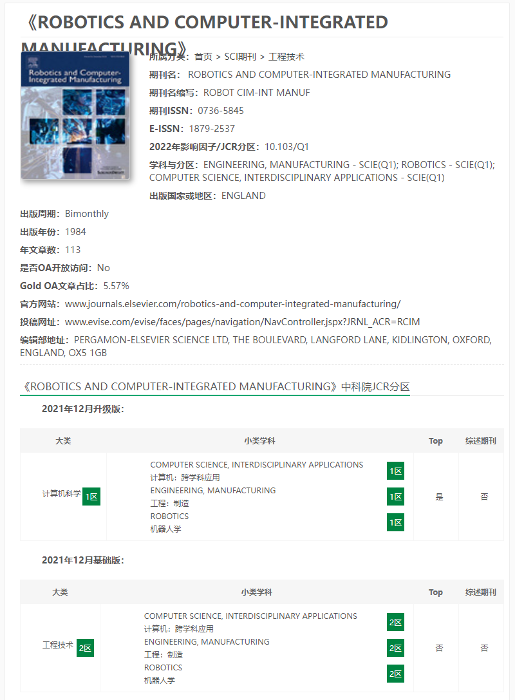](https://www.iikx.com/sci/technology/16885.html)

61.  Building And Environment 建筑与环境

> 高技术船舶

62.  Cold Regions Science And Technology 寒冷地区的科学技术

> 高技术船舶

63.  Corrosion Science 腐蚀科学

> 高技术船舶

64.  **Computers & Industrial Engineering 计算机和工业工程**

> 高技术船舶 **计算机：跨学科应用** 工程：工业

[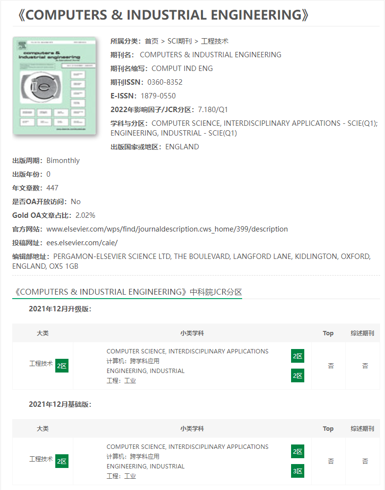](https://www.iikx.com/sci/technology/11654.html)

65.  **Engineering Applications Of Artificial Intelligence 人工智能的工程应用**

> 高技术船舶 工程：综合 自动化与控制系统 **计算机：人工智能** 工程：电子与电气

[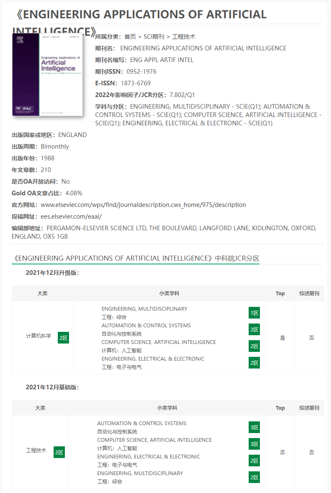](https://www.iikx.com/sci/technology/12154.html)

66.  Engineering Fracture Mechanics 工程断裂力学

> 高技术船舶

67.  Engineering Structures 工程建筑物

> 高技术船舶

68.  European Journal Of Mechanics A/Solids 欧洲力学杂志A / Solids

> 高技术船舶

69.  International Journal Of Fatigue 国际疲劳杂志

> 高技术船舶

70.  Journal Of Constructional Steel Research 建筑钢结构研究杂志

> 高技术船舶

71.  Journal Of Manufacturing Processes 制造工艺学报

> 高技术船舶

72.  Journal Of Manufacturing Systems 制造系统杂志

> 高技术船舶

73.  Journal Of Materials Processing Technology 材料加工技术杂志

> 高技术船舶

74.  Measurement Science And Technology 测量科学与技术

> 高技术船舶

75.  Mechanics Of Advanced Materials And Structures 先进材料和结构的力学

> 高技术船舶

76.  Safety Science 安全科学

> 高技术船舶

77.  Ships And Offshore Structures 船舶和海上结构物

> 高技术船舶

78.  Steel And Composite Structures 钢结构与组合结构

> 高技术船舶

79.  Transportmetrica A: Transport Science 交通测量学a：交通科学

> 高技术船舶

### 3.3 船舶与海洋工程国际核心类会议（B类成果）

1.  全国爆炸力学会议

> 船舶与海洋工程力学

2.  水动力学会议

> 船舶与海洋工程力学

3.  中国力学大会

> 船舶与海洋工程力学

4.  中国实验力学大会

> 船舶与海洋工程力学

5.  IAHR International Symposium On Ice IAHR国际冰学术研讨会

> 船舶与海洋工程力学

6.  ICCFD（International Conference for Computational Fluid Dynamics） 计算流体力学国际会议

> 船舶与海洋工程力学

7.  IWWWFB(International Workshop on Water Waves and Floating Bodies) 水波和浮体国际讲习班

> 船舶与海洋工程力学

8.  水下噪声会议

> 振动与噪声控制

9.  ICSV(International Congress on Sound and Vibration) 国际声音与振动大会

> 振动与噪声控制

10.  Inter-Noise 内部噪音

> 振动与噪声控制

11.  IMAM Conference IMAM会议

> 深海工程

12.  OMAE(International Conference on Ocean, Offshore & Arctic Engineering) 海洋、近海和北极工程国际会议

> 深海工程

13.  ICRA(International Conference on Robotics and Automation) 机器人与自动化国际会议

> 海洋机器人技术

14.  ISOPE(International Ocean and Polar Engineering Conference) 国际海洋与极地工程会议

> 高技术船舶

15.  Pedestrian And Evacuation Dynamics 行人和疏散动力学

> 高技术船舶

### 3.4 C类期刊

1.  爆炸与冲击

> 船舶与海洋工程力学

2.  工程力学

> 船舶与海洋工程力学

3.  工程热物理学报

> 船舶与海洋工程力学

4.  计算力学学报

> 船舶与海洋工程力学

5.  力学进展

> 船舶与海洋工程力学

6.  水动力学研究与进展（英文）

> 船舶与海洋工程力学

7.  应用数学和力学（英文版）

> 船舶与海洋工程力学

8.  Applied Sciences 应用科技

> 船舶与海洋工程力学

9.  Computational Mechanics 计算力学

> 船舶与海洋工程力学

10.  Computers& Fluids 计算机和流体

> 船舶与海洋工程力学

11.  Computer Modeling In Engineering & Sciences 工程与科学中的计算机建模

> 船舶与海洋工程力学

12.  Fluid Dynamics Research 流体动力学研究

> 船舶与海洋工程力学

13.  Journal Of Pipeline Systems Engineering And Practice 管道系统工程与实践杂志

> 船舶与海洋工程力学

14.  Journal Of Sandwich Structures And Materials 三明治结构与材料学报

> 船舶与海洋工程力学

15.  Mathematical Problems In Engineering 工程中的数学问题

> 船舶与海洋工程力学

16.  Results In Physics 物理学的结果

> 船舶与海洋工程力学

17.  Theoretical And Applied Mechanics Letters 理论力学和应用力学函件

> 船舶与海洋工程力学

18.  International Journal For Numerical Methods In Fluids 国际流体数值方法杂志

> 船舶与海洋工程力学

19.  Scientific Reports 科技报告

> 船舶与海洋工程力学

20.  Computers & Structures 计算机与结构

> 船舶与海洋工程力学

21.  Meccanica 物理

> 船舶与海洋工程力学

22.  Nanotechnology Reviews 纳米技术评论

> 船舶与海洋工程力学

23.  European Journal Of Mechanics B/Fluids 欧洲力学杂志B / Fluids

> 船舶与海洋工程力学

24.  声学学报

> 振动与噪声控制

25.  振动工程学报

> 振动与噪声控制

26.  振动与冲击

> 振动与噪声控制

27.  International Journal Of Acoustics And Vibration 国际声学与振动杂志

> 振动与噪声控制

28.  Journal Of Low Frequency Noise, Vibration And Active Control 低频噪声、振动与主动控制杂志

> 振动与噪声控制

29.  Journal Of Vibration Engineering And Technologies 振动工程与技术杂志

> 振动与噪声控制

30.  Shock & Vibration 冲击和振动

> 振动与噪声控制

31.  Journal Of Vibration And Acoustics 振动与声学杂志

> 振动与噪声控制

32.  太阳能学报

> 深海工程

33.  Coastal Engineering Journal 海岸工程学报

> 深海工程

34.  International Journal Of Maritime Engineering 国际海事工程学报

> 深海工程

35.  International Journal Of Naval Architecture And Ocean Engineering 国际船舶与海洋工程杂志

> 深海工程

36.  Journal Of Coastal Research 海岸研究杂志

> 深海工程

37.  Journal Of Engineering For The Maritime Environment 海事环境工程学报

> 深海工程

38.  Journal Of Mechanical Science And Technology 机械科学与技术杂志

> 深海工程

39.  Journal Of Mechanics 力学杂志

> 深海工程

40.  Journal Of Ocean Engineering And Marine Energy 海洋工程与海洋能源杂志

> 深海工程

41.  Marine Georesources & Geotechnology 海洋地质资源与地质技术

> 深海工程

42.  Sustainable Energy Technologies And Assessments 可持续能源技术和评估

> 深海工程

43.  China Ocean Engineering 中国海洋工程

> 深海工程

44.  Journal Of Fluids Engineering-Transactions Of The Asme 流体工程学报- ASME交易

> 深海工程

45.  Journal Of Marine Science And Engineering 海洋科学与工程学报

> 深海工程

46.  Journal Of Marine Science And Technology 海洋科学与技术杂志

> 深海工程

47.  Journal Of Offshore Mechanics And Arctic Engineering 近海力学与北极工程学报

> 深海工程

48.  控制理论与应用

> 海洋机器人技术

49.  控制与决策

> 海洋机器人技术

50.  自动化学报（中文版）

> 海洋机器人技术

51.  International Journal Of Fuzzy Systems 国际模糊系统杂志

> 海洋机器人技术

52.  兵工学报

> 高技术船舶

53.  船舶力学

> 高技术船舶

54.  哈尔滨工程大学学报（中英文版）

> 高技术船舶

55.  焊接学报

> 高技术船舶

56.  华中科技大学学报(自然科学版)

> 高技术船舶

57.  机械工程学报

> 高技术船舶

58.  **计算机辅助设计与图形学学报**

> 高技术船舶

59.  交通运输工程学报

> 高技术船舶

60.  金属学报

> 高技术船舶

61.  上海交通大学学报

> 高技术船舶

62.  推进技术

> 高技术船舶

63.  武汉理工大学学报

> 高技术船舶

64.  西北工业大学学报

> 高技术船舶

65.  中国造船

> 高技术船舶

66.  Brodogradnja

> 高技术船舶

67.  Cmes-Computer Modeling In Engineering & Sciences Cmes -工程与科学中的计算机建模

> 高技术船舶

68.  International Shipbuilding Progress 国际造船进展

> 高技术船舶

69.  Journal Of Composite Materials 复合材料杂志

> 高技术船舶

70.  Journal Of Ship Research 船舶研究杂志

> 高技术船舶

71.  Materials 材料

> 高技术船舶

72.  Proceedings Of The Institution Of Mechanical Engineers, Part O: Journal Of Risk And Reliability 机械工程师学会论文集，O部分：《风险与可靠性》

> 高技术船舶

73.  Review on advanced materials science 先进材料科学评论

> 高技术船舶

74.  Science Progress 科学进步

> 高技术船舶

75.  Advances In Mechanical Engineering 机械工程的进展

> 高技术船舶

76.  International Journal For Numerical Methods In Engineering 国际工程数值方法杂志

> 高技术船舶

77.  Smart Materials And Structures 机敏材料与结构

> 高技术船舶
